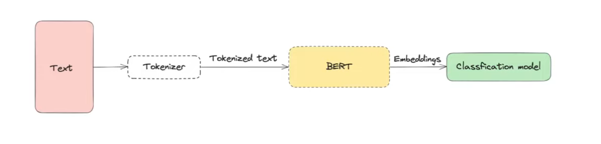

## 📚 References 
- Tags :  [[Transformers]]
- Links: 

## ❓ Questions
- 

## 🔗 Related material

# Bidirectional Encoder Representation from Transformers
Это энкодер из трансформера. В задачах ниже работает так:

### Где применяется
1. SQuAD - найти в определенном контексте ответ на заданный вопрос
2. NER - распознование именнованных сущностей. 
3. Multi NLI (Natural Language Inference) - могут ли рядом друг с другом стоять два предложения по смыслу. Еще ответит на такой вопрос: 
 
 *
 'Этот текст о квантовых компьютерах?' 
 Квантовый компьютер (в отличие от обычного) оперирует не битами, а кубитами".*

4. Классификация текста и т.д

### Как обучается Bert
- **Mask Language Modeling**. 80% времени учится предсказывать следующий элемент в последовательности (Я кушал [MASK]  - Я кушал рыбу). 
- 10% не даем заучить удобные последовательности для минимизации $Loss$ (pred = "Я кушал рыбу", target = "Я гулял рыбу")
- 10% треним как автоэнкодер.

