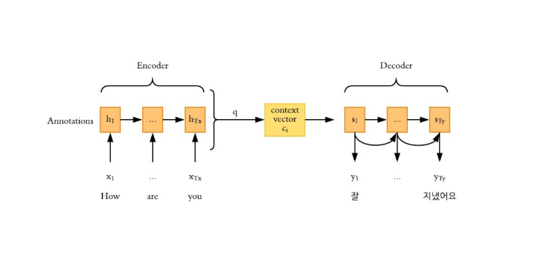

# 📚 References 
- Tags :  [[Attention]] [[Bert]] [[Transformer]]
- Links: [Презентация](https://github.com/veidlink/ds-phase-2/blob/master/slides/attend&transform.pdf)

# ❓ Questions
- Что поступает decoder в роли x2,3...t?

# 🔗 Related material

# Encoder & Decoder с контекстным вектором

Encoder и Decoder тут - RNN. Последний hidden state vector -> context vector  и подается в роли $h_{0}$ декодеру. Как $x_{1}$ мы отправляем $<sos>$ token, в роли следующего икса подается (кумулятивный) выход из предыдущих ячеек. Decoder дальше предсказывает каждое отдельное слово.

Что идет на вход decoder как x2, x3...
1. SOS → «Как»
2. SOS, Как → «Дела»
3. SOS, Как, дела → «?»

---
1. Используется именно последний вектор, а не flatten всех скрытых состояний, т.к. размер context vector станет громадным и это не обучить.