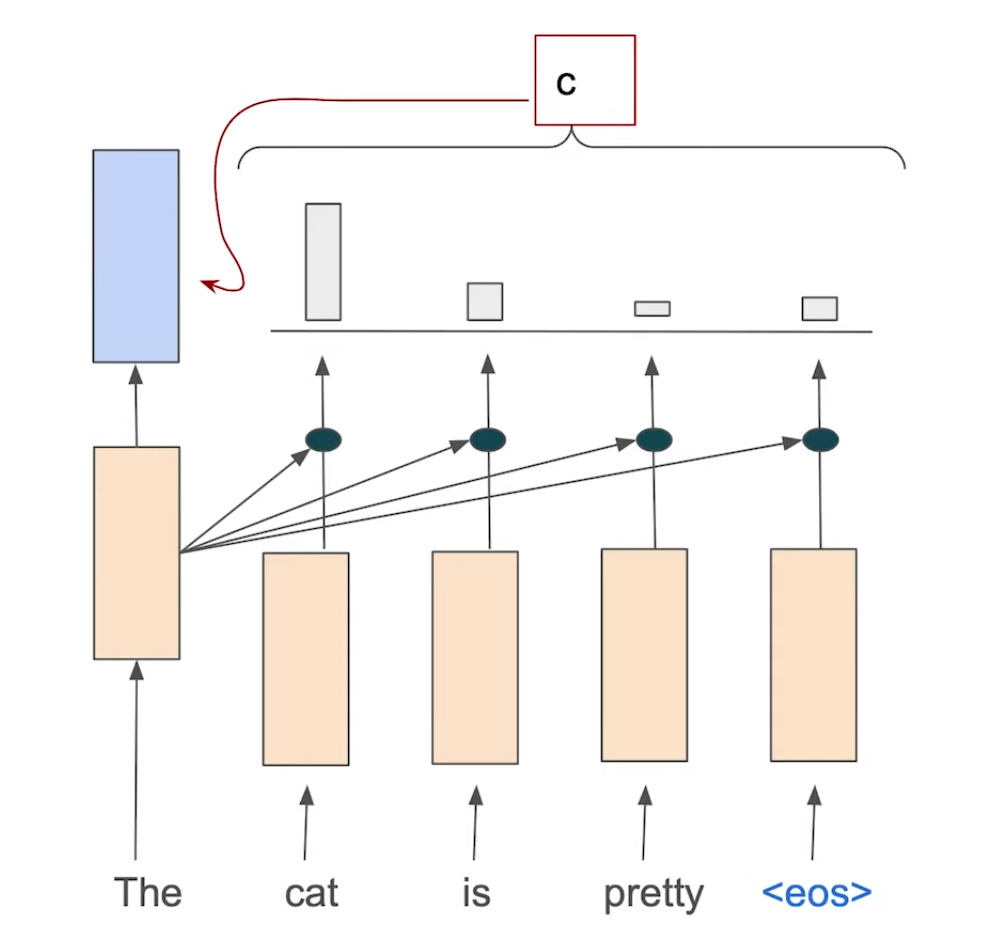
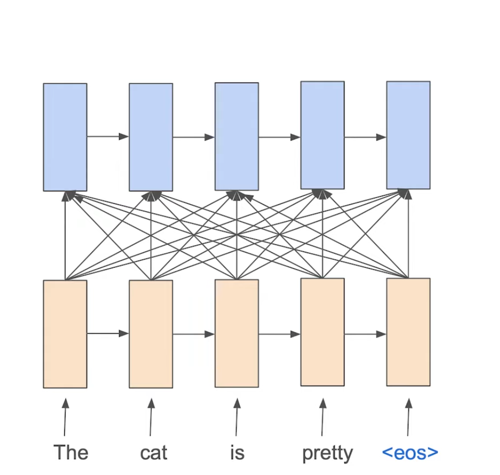
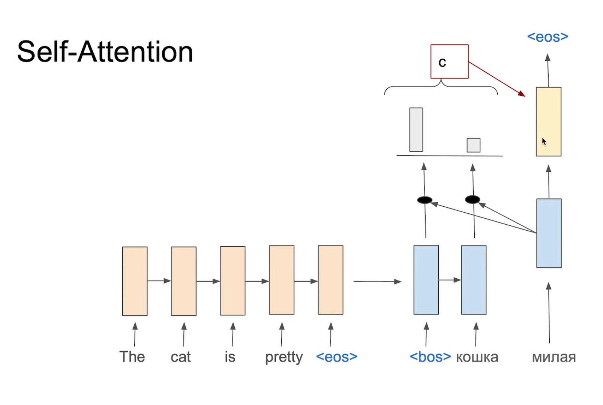

# 📚 References 
- Tags :  [[Attention]]
- Links: те же самые что и в Attention

# ❓ Questions
- 

# 🔗 Related material

# Self-attention
###  
 Идея 

- *Max went out to the local shawarma stand to savor a fine meal, but saw that it was closed*
- *Максим отправился в местную шаурмечную, чтобы отведать изысканного блюда, но увидел, что она закрыта*

Чтобы перевести "saw" в нужном роде, нужно посмотреть не на предложение на английском, а уже переводимое на русском и помнить про то, что Максим мужского рода. Также и "она закрыта. Это делает self-attention.

###  Последовательность действий  
1. Применяем self-attention в encoder

2. Обновляем все hidden state энкодера.

**Зачем это делается?** Скрытые состояния получают больше информации о себе в грамматическом смысле.

3. Применяем self-attention в decoder из целей озвученных в Идее.

Единственное отличие - он не может смотреть связь с будущими словами, т.к. мы еще их не перевели.