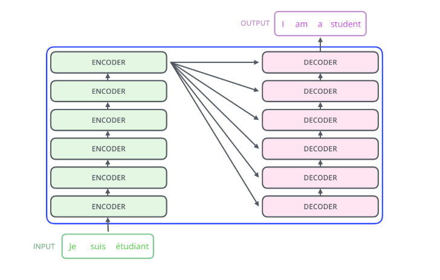
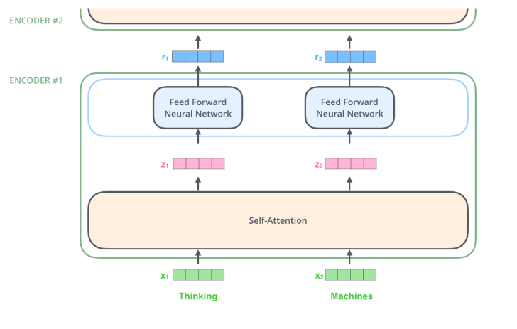
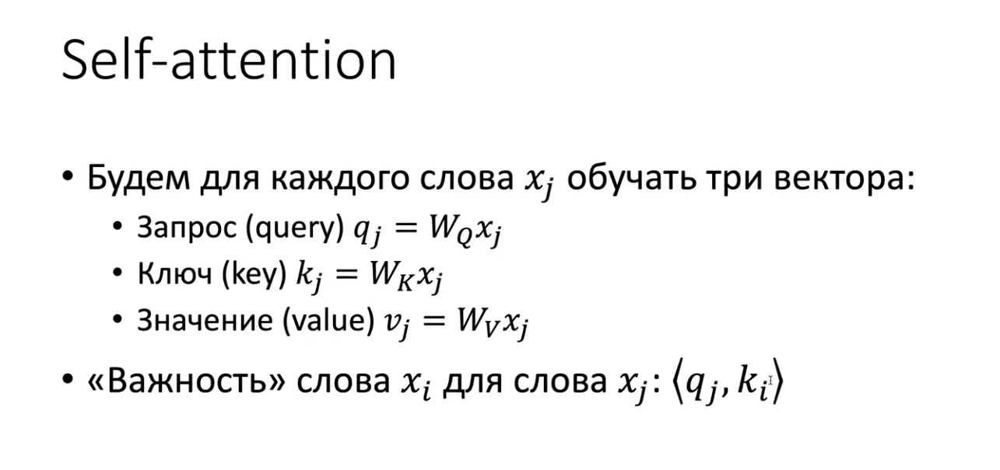
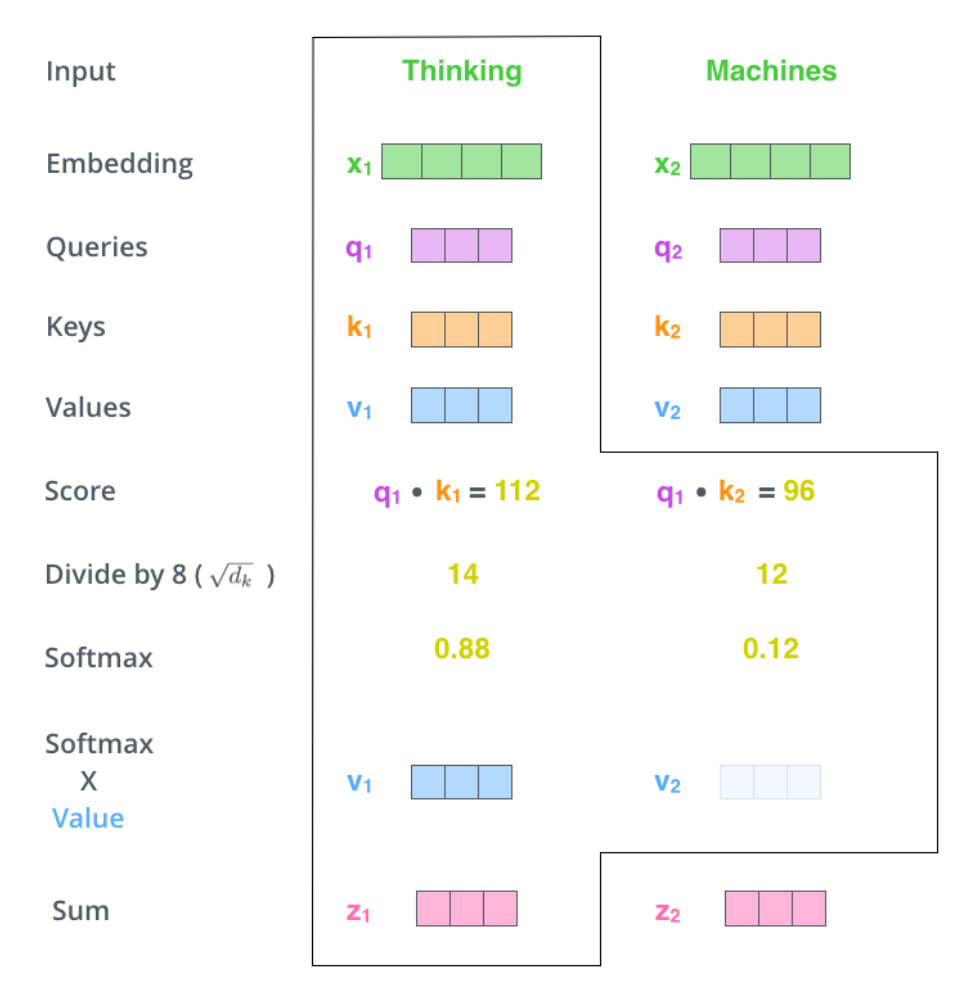
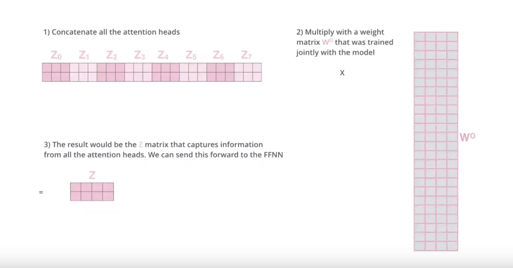
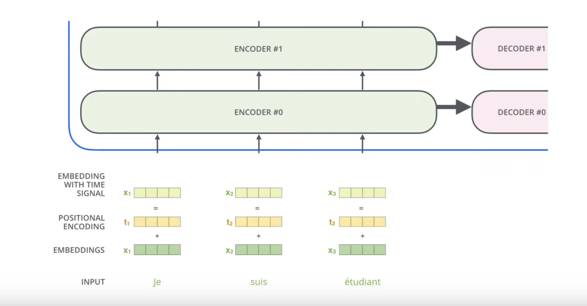
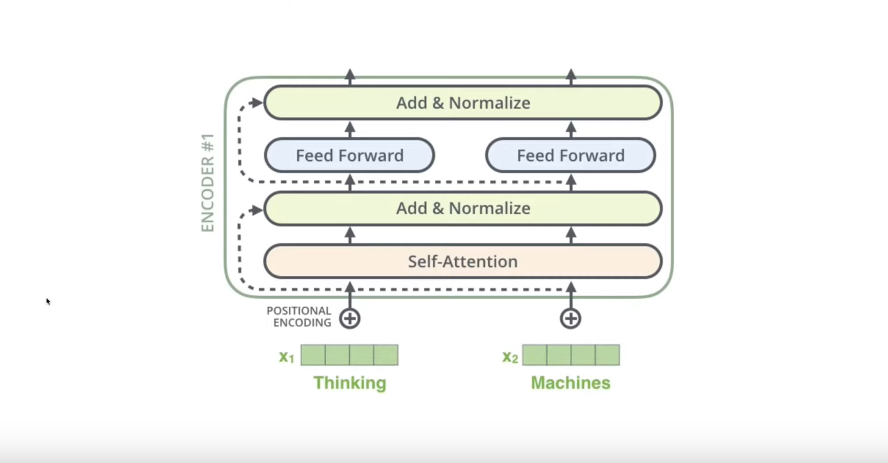
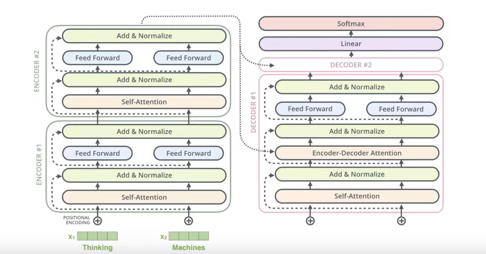

## 📚 References 
- Tags :  [[Encoder & Decoder]] [[NLP (Natural language processing)]] [[Seq2Seq]]
- Links: [Видео с ИАД](https://www.youtube.com/watch?v=P5wNb9Mt9RE)

## ❓ Questions
- 

## 🔗 Related material

# Transformers - Seq2Seq  без RNN.

 В обобщенном виде:
 
 Поэтапно разберем архитектуру.

## Заглянем внутрь энкодера

 
На вход приходит два hidden state, считается self-attention каждого вектора, обновляются вектора, передается следующему энкодеру.

Больше энкодеров - больше сложность модели, более сложные закономерности выявляет архитектура.

### Реализация self-attention в transformers 
В self-attention мы считаем скалярное произведение (или любой другой attention) между самими hidden states. Потом в софтмакс, считаем вектор контекста, обновляем hidden states. **Здесь ничего не меняется.** Просто добавились линейные слои с матрицами весов, которые ставятся перед hidden states и являются обучаемыми. Это лишь архитектурное решение, глобально не меняющее ничего.

#### Как считается context vector в transformers
 
$Z_{1}$ тут вектор контекса, образованный взвешенной суммой $v_{1} + v_{2}$, где веса это - важность слова полученная софтмаксом.

#### Реализуем Multi-headed SA
Трансформер пользуются выгодой MDSA: каждый self-attention улавивает закономерности разного характера между словами.
 
 Все полученные attentions конкатенируются (каждая строка в матрице - один hidden state), проходят линейный слой с тренируемыми весами для минимизации $Loss$. На выходе имеет матрицу новых сверх hidden states, улавливающих целых 8 закономерностей.

### Делаем Positional Encoding
В отличие от $RNN$, здесь нет последовательной обработки слов или какой-то истории, они закидываются в слои и идут по ним одновременно -> не учитывается порядок.

Это фиксит [[Positional Encoding]].

Суть в том, что мы перед забрасыванием hidden states в encoding layers прибавляем к hiddem states вектора, которые что-то говорят нам о позиции слова в тексте.
 
### Общая схема энкодера

1. Принимаем скрытые состояния после эмбэддинга
2. Делаем Positional encoding, складывем векторы.
3. Считаем self-attention, обновляем векторы.
4. Add & Normalize принимает векторы, и складывает их с векторами до self-attention (Архитектурное решение). Делаетс нормализация (используется LayerNorm - разновидность [[Batch-normalization]])
## Заглянем внутрь дэкодера

Лучше бы не заглядывал.