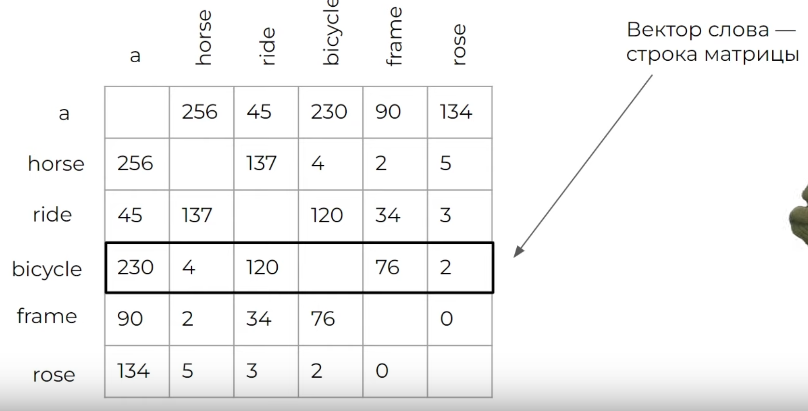
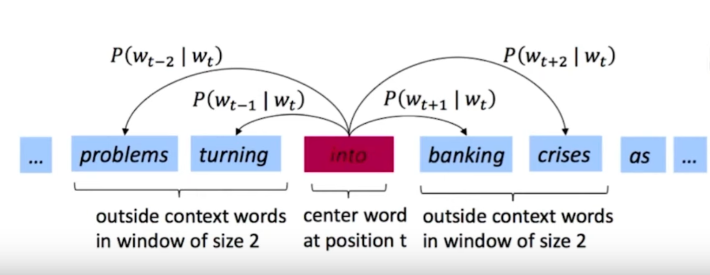
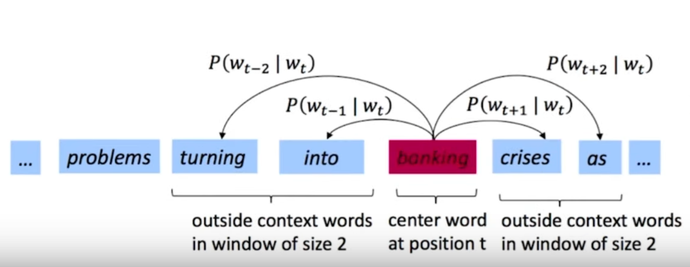
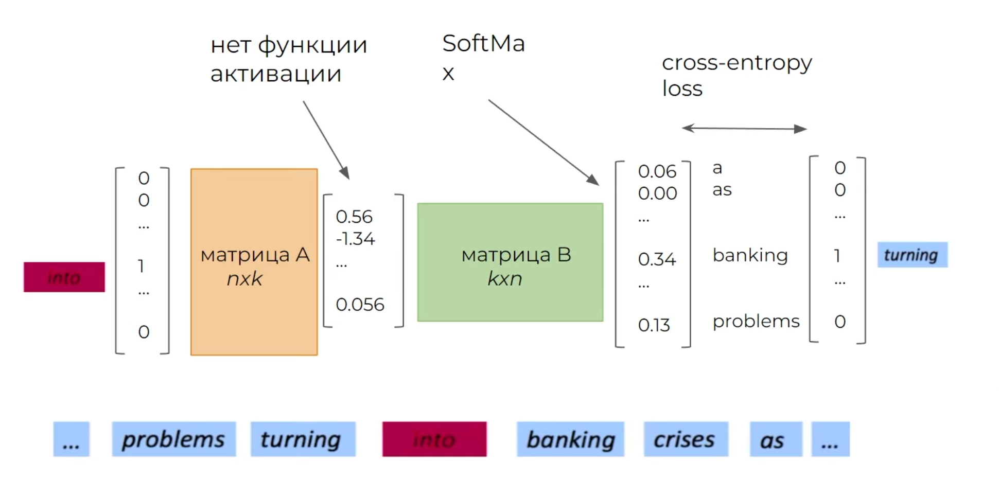
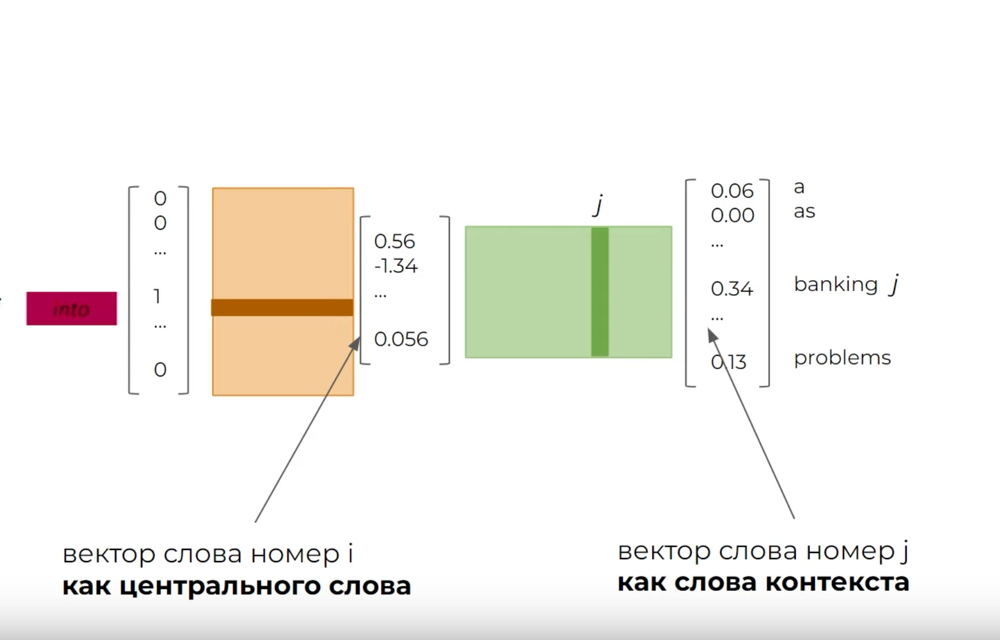
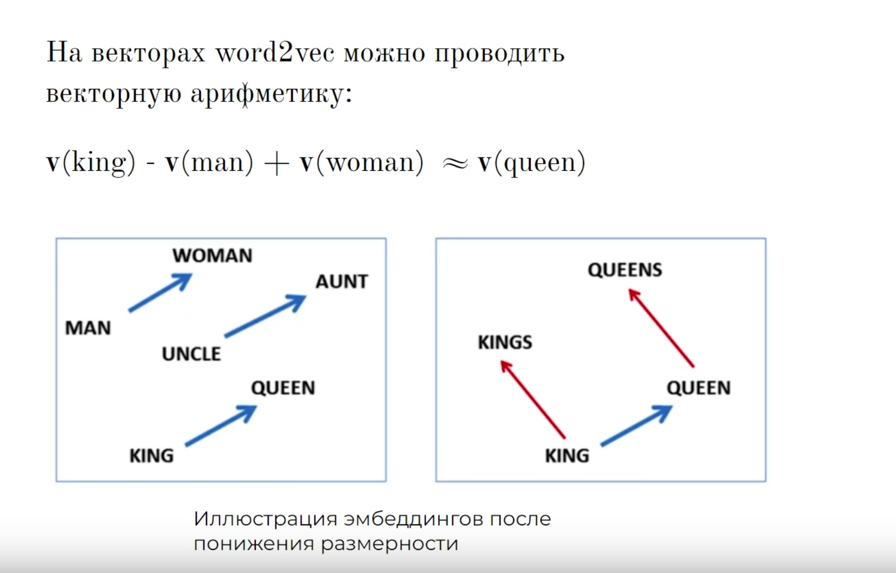

# 📚 References 
- Tags :  [[RNN - Recurrent Neural Network]]
- Links: [Deep learning school](https://www.youtube.com/watch?v=WbtQzAvhnRI)

# ❓ Questions
- 

# 🔗 Related material

# Word2Vec

**Контекстные вектора слов**. Берем окно из 5 слов, пробегаемся по тексту. В этом окне есть центральное слово, и остальные слова, смотрим сколько раз эти слова попадались с центральным вместе, составляем матрицу:

## Как бороться с разряженностью вектора
Вектор информативен, передает смысл слова, но разреженный. 
1) Можем понизить размерность ([[UMAP]], [[PCA]], [[TSNE]]). 
2) Или применить [[SVD]] (сингулярное разложение)
***
Ранее мы представляли слова в векторах либо основываясь на их частоте, либо на контексте.
Продолжая идею контекста, попытаемся выучить векторы слов, чтобы предсказывать окружение центрального слова в moving window (Skip-gram). Есть также вариант обучения, когда по контексту предсказывают центральное слово (CBOW).

## Обучение

- На вход принимает one-hot vector центрального слова
- Сжимает его
Почему между сжимом и разжимом нет активации?
- Разжимает его
- Софтмакс возвращает распределение вер-тей. Лосс измеряем по one-hot вектору предсказываемого слова.

- Модель обучается таким образом, что матрицы А и Б хранят эмбеддинги векторов. Через их перемножение получается распределение вероятностей на выходе. Учится таким образомом, что чем больше вероятность встретить в контексте j-e слово, тем больше скалярное произведение i * j (вспомни косинусное сходство и формулу ск. произв.)
- Эмбеддинги похожи, но немного разные. В целом можно использовать как А, так Б.
- Важно понять, что благодаря такому обучению, вектора запомнили СМЫСЛ слова, поэтому Word2Vec можно объяснить так:
