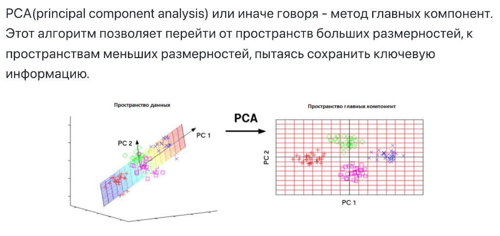
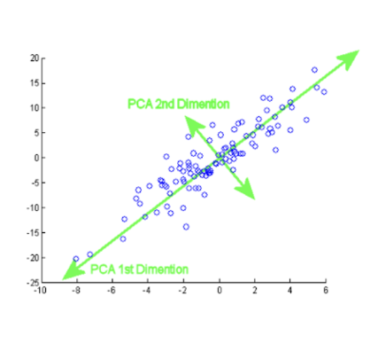

## 📚 References 
- Tags :  [[Проклятье размерности]] [[Понижение размерности]]
- Links: [Презентация](https://github.com/veidlink/ds-phase-1/blob/master/slides/LinAlg_day2.pdf)

## ❓ Questions
- 

## 🔗 Related material

# Principal component analysis | Метод главных компонент

**
 <mark style="background: #FF5582A6;">Идея</mark>
**

**Лигейный** алгоритм понижения зависимости. Точки задаются тремя координатами (лежат в 3-х мерном пр-ве). Но можно заметить, что они все вокруг какой-то плоскости. Так почему бы нам не убрать лишнию размерность, ведь плоскость можно задать 2-мя координатами.

**Здесь хорошо виден важный момент.** Происходит сокращение размерности с 2 до 1 с небольшой потерей инфы. НО! Новые базисные вектора (зеленые) намного эффективней прошлых. Вокруг первого и второго вектора плотно сосредоточена вся дисперсия, вокруг первого основная ее масса -> проецируем точки по второму вектору на первый и отбрасываем измерение, которое объясняет меньше дисперсииж.