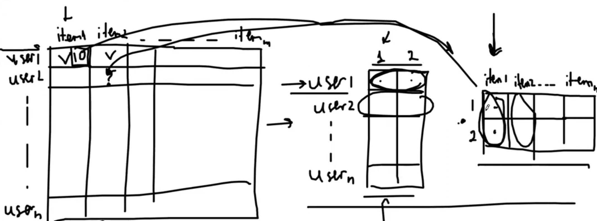

## 📚 References 
- Tags :  [[Понижение размерности]] [[Проклятье размерности]] [[Рекомендательные системы]]
- Links: [Презентация](https://github.com/veidlink/ds-phase-1/blob/master/slides/LinAlg_day2.pdf)

## ❓ Questions
- 

## 🔗 Related material

# Singular value decomposition |  Сингулярное разложение

#### 
<mark style="background: #FF5582A6;">Идея</mark>

Любая матрица $M$ как-то изменяет пространство. И ее можно разложить на 3 матрицы - матрица первого поворота $U$, матрица сжатия $Σ$,  матрица второго поворота $V*$. Углубляться в получение этих матриц не будем с целью сохранения психики.

#### 
<mark style="background: #FF5582A6;">Пример</mark>

Эти 3 матрицы могут выглядеть так

Центральная матрица по главной диагонали хранит сингулярные значения, сортируя их по убыванию. Мы можем взять кусок этой матрицы (первые $top$ $k$ значений), соответственно $top$ $k$ столбцов матрицы первого поворота $U$ и $top$ $k$ строк матрицы второго поворота  $V*$.

#### 
<mark style="background: #FF5582A6;">Объяснение Антона в рамках Рекомендательных систем</mark>

Значение оценки $item_{1}$ получается умножением элементов двух матриц на рисунке. В первой матрице столбцы - сюжет, актерский состав и т.д. фильма, во втором - то, что по этим параметрам может предложить фильм. Это называется латентными представлениями. Пока не совсем понятно, но в будущем в эту сторону следует покопать.

Резюмируя -> SVD пытается объяснить предпочтения скрытыми закономерностями, то, что очень часто не может сделать сам человек (почему мне нравится эта песня, почему мне нравится этот фильм, обычно я такое не слушаю...)

-> Мы можем отбрасывать **очень** много сингулярных чисел, ибо они отсортированы по убыванию и хранят инфу пропорционально!